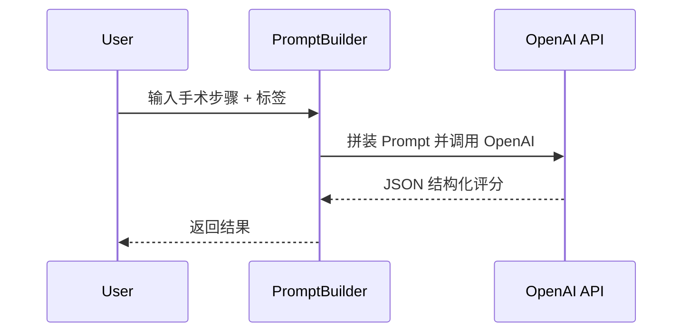

# 医院 Agent 质控 Demo — MVP PRD

本版本聚焦 **最小可行性验证（MVP）**：证明"大模型 + 质控 Prompt"能够对手术文字步骤给出可用的结构化评分与改进建议。除核心工作流外，不纳入前端、DevOps、复杂检索服务等内容。

---

## 1. 背景
1. 传统手术质控依赖人工复核，费时费力、主观性强。
2. 大语言模型（LLM）的医学推理能力已达到可用水平，可在示例数据集上替代部分人工审核。

## 2. MVP 目标
| 项 | 说明 |
|---|---|
| 输入 | 手术文字步骤（≈ 300–800 字）+ 手术类型标签 |
| 输出 | ① 0–100 总分 ② 风险要点列表 ③ 改进建议列表（全部结构化 JSON） |
| 手术范围 | 仅验证 3 种常见手术：阑尾切除、胆囊切除、胃穿孔修补 |
| 成功标准 | 10 份示例数据中，≥ 70 % 的 LLM 输出被质控医生评为"有实用价值" |
| 调用方式 | **OpenAI Chat API**（官方 `gpt-4o` 或企业版本） |

## 3. 核心工作流

> 仅使用一个 Python 脚本 (`evaluate.py`) 即可跑通；**不依赖任何第三方 SDK**，使用 Python 标准库 `urllib.request` 直接向 `https://api.openai.com/v1/chat/completions` 发送 HTTPS POST。无需后端服务或数据库。

### 3.1 Prompt 模板（示例片段）
```
系统：你是一名资深手术质控专家，请根据以下【手术步骤】给出评分与建议。严格输出 JSON，字段：total_score, risks[], suggestions[]。
```

## 4. MVP 实现清单
1. `evaluate.py`  
   - 读取 `steps.txt`（或命令行输入）
   - 使用 `urllib.request` 构造 `POST` 请求到 `https://api.openai.com/v1/chat/completions`，携带 `Authorization: Bearer <API_KEY>` Header
   - 打印 JSON 结果
2. 示例数据集：`data/sample_*.txt` 共 10 份
3. `prompt.md`：系统 & 用户 Prompt 模板
4. `README.md`：运行指令 `python evaluate.py --file data/sample_01.txt`
5. 快速评测脚本：`quick_eval.py` 将模型输出与人工评分对比（Excel or CSV）

## 5. 时间线
| 天 | 交付物 |
|---|---|
| D0 | 本 PRD 确认 |
| D1 | `evaluate.py` + Prompt 模板完成，可本地调用 OpenAI |
| D2 | 10 份示例数据整理 & 运行结果收集 |
| D3 | 医生评审 & 成功率统计；MVP 评审会 |

## 6. 潜在风险
| 风险 | 缓解措施 |
|---|---|
| 大模型输出不符合 JSON | 使用 `response_format={'type':'json_object'}` 并做异常捕获 |
| 费用超预期 | 控制输入 < 1 k tokens，限制最大输出 512 tokens |
| 医学术语歧义 | 手动在输入步骤中添加注释/ICD 编码 |

---
*最后更新：{{date}}*